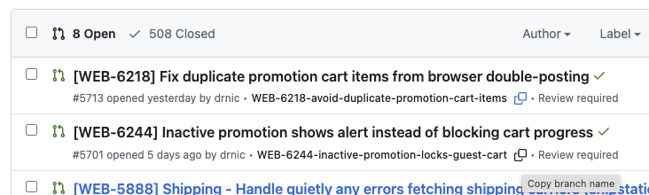

# GitHub Worktrees Chrome Extension

A Chrome extension that enhances GitHub PR lists by displaying branch names with convenient copy-to-clipboard functionality.



## Features

- **Branch Name Display**: Shows the branch name inline on each PR in the GitHub PR list view
- **Copy to Clipboard**: Click the clipboard icon to instantly copy branch names
- **GitHub UI Integration**: Seamlessly matches GitHub's design and styling
- **Dynamic Loading**: Works with GitHub's dynamic content loading and pagination

## Installation

### Development Installation

1. Clone this repository
2. Install dependencies: `npm install`
3. Build the extension: `npm run build`
4. Open Chrome and navigate to `chrome://extensions/`
5. Enable "Developer mode" in the top right corner
6. Click "Load unpacked" and select the `dist/` folder
7. The extension will now be active on GitHub PR pages

### Development Commands

- `npm run dev` - Build and watch for changes during development
- `npm run build` - Build for production
- `npm run build:zip` - Build and create zip file for Chrome Web Store
- `npm run clean` - Remove build artifacts
- `npm run lint` - Run code linting

### Usage

1. Navigate to any GitHub repository's Pull Requests page (e.g., `https://github.com/owner/repo/pulls`)
2. Branch names will automatically appear next to the "opened by..." text
3. Click the clipboard icon (📋) next to any branch name to copy it to your clipboard
4. Use the copied branch name in your terminal for git operations like:
   - `git fetch origin <branch-name>`
   - `git checkout <branch-name>`

## Debugging

The extension includes optional debug logging to help troubleshoot issues:

1. Click the extension icon in your Chrome toolbar while on a GitHub page
2. Toggle the "Debug logging" switch in the popup
3. Open Chrome DevTools (F12) and check the Console tab
4. Debug messages will appear with 🌳 prefixes when enabled
5. Toggle can be turned off anytime to reduce console noise

Debug logging is **off by default** and only shows extension-specific messages when enabled.

## File Structure

```
github-worktrees-chrome-extension/
├── manifest.json          # Extension manifest (Manifest V3)
├── content-script.js      # Main orchestration logic
├── styles.css            # GitHub-compatible styling
├── popup.html            # Extension popup interface
├── popup.js              # Popup functionality
├── src/                   # Modular library structure
│   ├── utils/            # Generic utilities
│   │   ├── debug-logger.js  # Conditional logging with Chrome storage
│   │   ├── semaphore.js     # Concurrency control for async operations
│   │   └── storage.js       # Chrome storage utilities with TTL caching
│   ├── github/           # GitHub-specific functionality
│   │   └── api.js           # GitHub API interactions and DOM extraction
│   └── dom/              # DOM manipulation utilities
│       └── ui-helpers.js    # UI creation and GitHub styling integration
├── icons/                # Extension icons
│   ├── github.svg
│   ├── github-16.png
│   ├── github-32.png
│   ├── github-48.png
│   └── github-128.png
├── CLAUDE.md             # Development guidance for Claude Code
├── PRD.md               # Product Requirements Document
└── README.md            # This file
```

## Technical Details

- **Manifest Version**: 3 (latest Chrome extension standard)
- **Permissions**: Minimal permissions for GitHub access only
- **API Usage**: Uses GitHub's REST API to fetch branch information
- **Performance**: Efficient DOM observation and caching to minimize impact

## Browser Support

- Chrome (latest)
- Chromium-based browsers (Edge, Brave)

## License

MIT License - See LICENSE file for details
